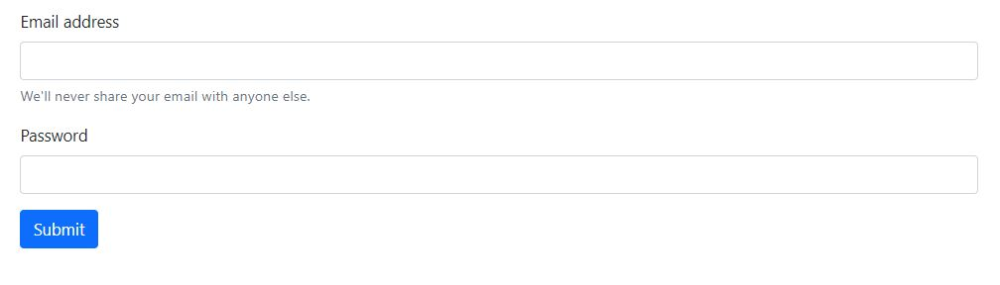

# REGEX  
Vous devez créer une application de connexion.  
Avec les expressions régulières, le mot de passe doit comporter obligatoirement :

* Minimum 8 caractères
* Des majuscules et minuscules
* Des caractères spéciaux
* Des chiffres  

    

Page de connexion  

 
